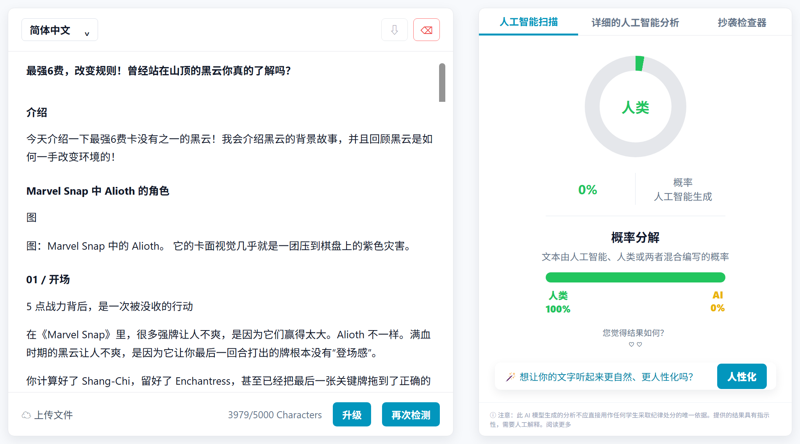
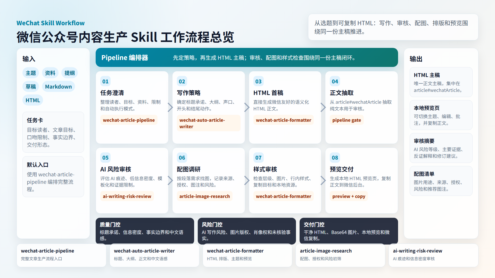
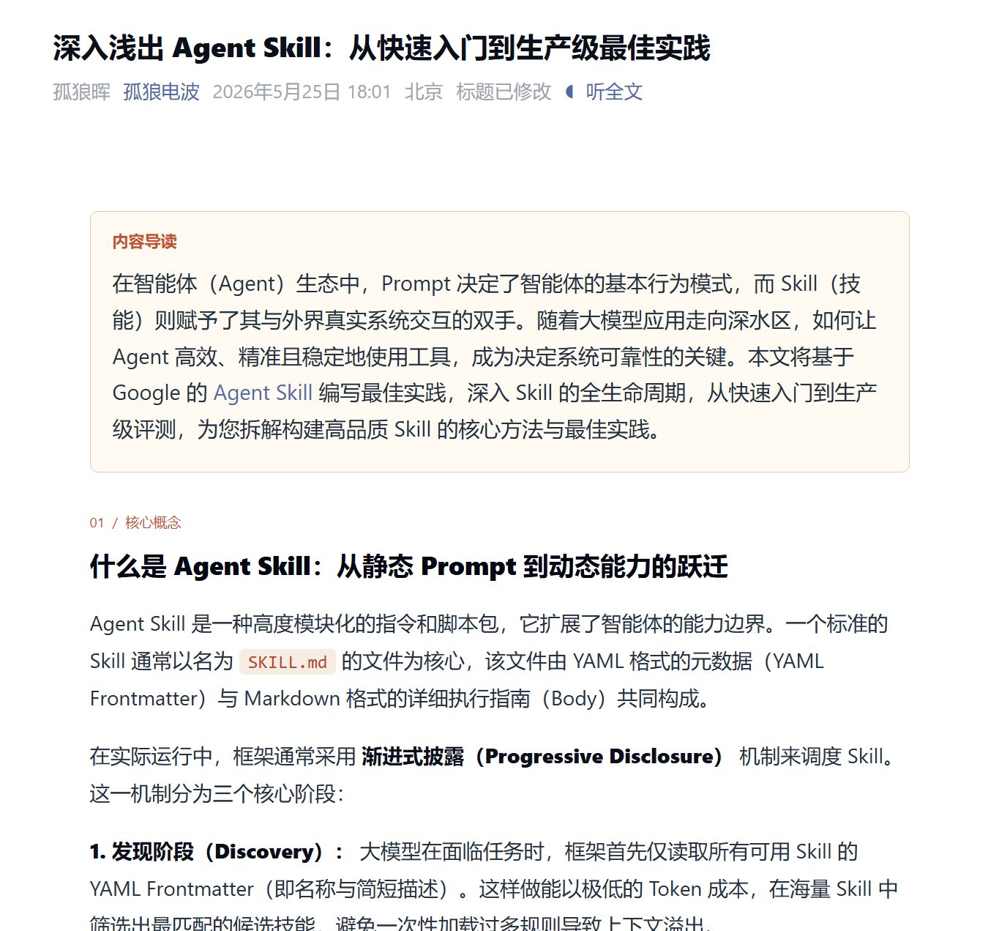

## AIME WeChat Skill

**“专注于AI协同生产高质量的文章：高效、美观、有深度”。**

**“一键生成，快速复制，让你回归更有价值的创作本身”。**

去除AI味，阅读更自然：



## 1. 项目简介



本仓库提供一组专门服务微信公众号文章生产的 Skill：

- 从主题、资料或提纲出发，生成文章策略、大纲、标题和正文。
- 把正文整理为排版精良的 HTML，快速预览、便捷修改。
- 可调研正文配图、封面候选、来源、授权和使用风险。
- 可评估文章的 AI 写作风险、模板化痕迹和信息密度问题。
- 可将以上环节串成一条完整的文章生产流水线。

最终交付通常是本地预览页，快速复制粘贴到公众号后台。


内置10余款主题，让你告别排版烦恼，基于html排版，样式更丰富。

## 实际效果预览

[查看已发布的微信文章：深入浅出 Agent Skill：从快速入门到生产级最佳实践](https://mp.weixin.qq.com/s/ndwC8KsZNkUCNNWPf52TsA)



## 2. 典型使用场景是什么？

- 写一篇新的微信公众号文章：输入主题、读者、资料和口吻要求，让 LLM 先定策略，再生成 HTML 主稿。
- 改写已有草稿：优化标题、摘要、开头、结构、中文表达和结尾动作。
- 生成微信排版：把提纲、笔记、Markdown 或已有 HTML 整理为可复制的微信正文。
- 本地预览和复制：生成完整 HTML 预览页，在浏览器中检查样式，再复制正文到微信后台。
- 查 AI 味：对草稿做 AI 写作风险评估，找出模板化、低信息密度和过度平滑的段落。
- 找正文配图：为具体小节寻找有来源、有授权记录、能支撑正文的图片候选。
- 一条龙生产：用 `wechat-article-pipeline` 编排写作、审核、配图、样式检查和最终预览。

## 3. 项目亮点

- **HTML 优先工作流**：排版阶段直接以 HTML 作为正文主稿，减少 Markdown 与 HTML 两份内容来回同步的成本。
- **生成 HTML 预览页面，并可以微调样式**：`wechat-article-formatter` 可以生成完整本地预览页，预览页支持主题切换、编辑、批注、复制正文等操作，方便在复制到微信后台前检查和微调样式。

- **微信复制友好**：正文主体集中在 `article#wechatArticle`，便于抽取、复制和交接。
- **本地图片内联处理**：对本地图片资源提供 Base64 Data URL 内联脚本，降低复制到微信后台后图片失效的风险。
- **内容风险前置**：内置 AI 写作风险评估和配图授权风险初筛，让发布前检查更系统。
- **AI 写作风险扫描**：`ai-writing-risk-review` 可以对文章进行类似检测器的风险扫描，输出人工/AI 风险等级、概率拆解、主要证据、反证解释和修订建议，帮助用户提升自然表达、信息密度和可核验性。
- **模块可单独使用**：写作、排版、找图、审核、流水线都可以独立调用。

## 4. 每个 Skill 功能描述

| Skill | 功能描述 | 适合什么时候用 |
| --- | --- | --- |
| `wechat-article-pipeline` | 完整流水线入口，编排写作策略、HTML 主稿、AI 写作风险审核、配图确认、样式审核和最终预览。 | 想把公众号文章从主题一路做到可预览、可复制的交付物。 |
| `wechat-article-writer` | 负责公众号写作、改写、拟纲、标题、摘要、开头、结构、中文语感、信息密度和结尾动作。 | 已有主题、资料或草稿，需要把文章写顺、写具体、写得更像真实账号内容。 |
| `wechat-article-formatter` | 负责生成、规范化、主题化和预览微信 HTML 正文；支持本地预览页、主题预设、正文复制和图片内联。 | 已有正文、提纲、Markdown 或 HTML，需要排成微信公众号可用格式。 |
| `article-image-research` | 负责配图调研、来源记录、授权/归因、正文匹配度评分和风险初筛。 | 需要为正文小节、封面、解释图、产品图、截图或证据图找可追溯图片。 |
| `ai-writing-risk-review` | 负责评估 AI 写作、AI 辅助润色、人机混写或模板化写作风险，输出风险等级、概率拆解、证据链、反证解释和修订建议。 | 需要检查文章是否有明显 AI 痕迹、低信息密度或模板化表达，并希望提升文本自然度和可信度。 |


### 通过 GitHub 安装

把下面提示词发给当前 AI 客户端即可：

```text
请帮我把 wechat-auto-skill 自动下载并安装到当前 AI 客户端的 skill 目录下。

- 项目地址：https://github.com/zacktian89/wechat-auto-skill
- Skill 目录：https://github.com/zacktian89/wechat-auto-skill/tree/master/skills
```

## 使用边界

- 项目负责内容生成、排版预览、复制准备和发布前风险提示。
- 微信后台发布、平台审核、版权确认、事实核验仍需要人工完成。
- 涉及时效事实、政策、金融、医疗、法律、争议事件或商业发布时，应在发布前单独核验。
- AI 写作风险评估只提供风险判断和证据，不等同于作者身份或创作过程结论。
